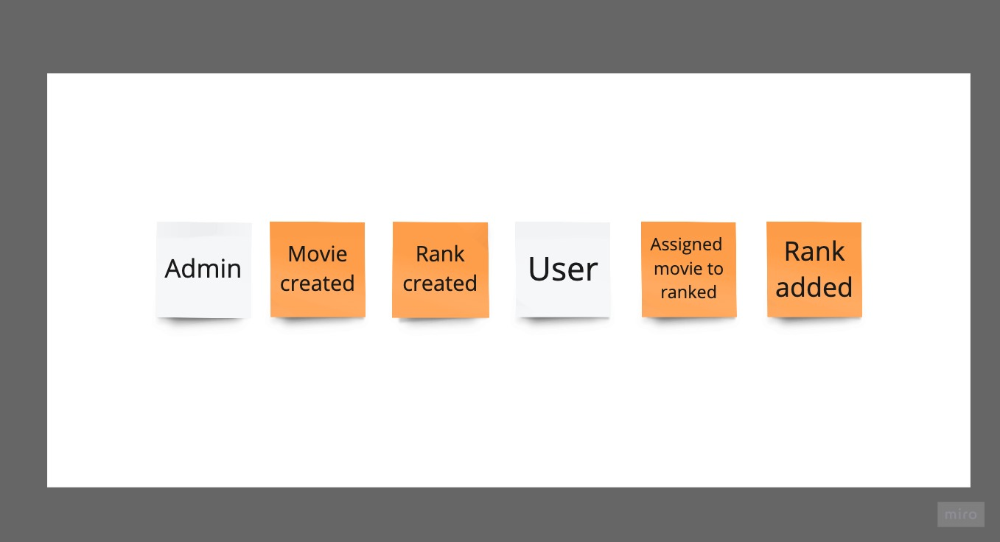

## Problem space

The high-level functional requirements for the new "Movie rating" system are as follows.

### Process Level Event Storming

### Project is too small so only one subdomain: "rating" was proposed it consists with one bounded context.

